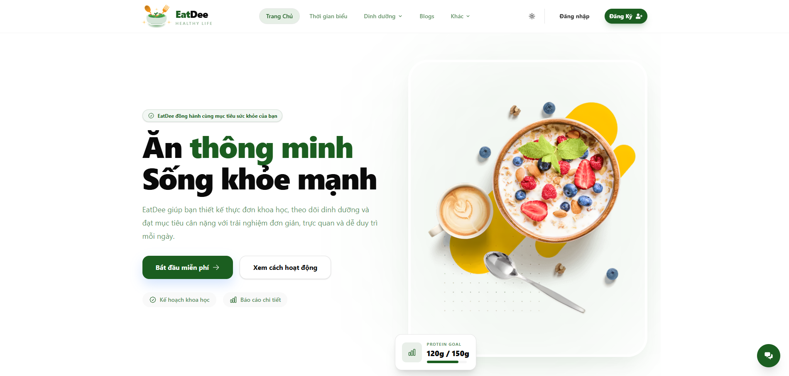

# Eatdee - Nutrition Schedule

**Eatdee** is a nutrition scheduling platform that helps users plan meals and receive personalized meal recommendations based on their health goals.

## Screenshots

## Features

### Smart Scheduling

- Plan daily, weekly meal schedules
- Track nutrition goals over time
- Flexible meal planning

### Personalized Meal Recommendations

- Suggestions based on your health profile
- Tailored to dietary restrictions and preferences
- Balanced nutrition guidance for your goals

## Tech Stack

**Frontend:** React + Vite  
**Backend:** Express + Node.js  
**Database:** MongoDB
